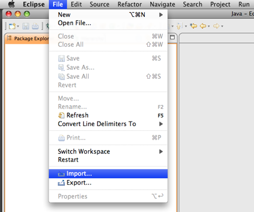
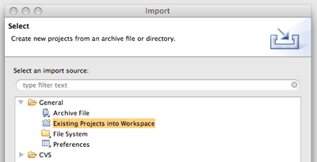
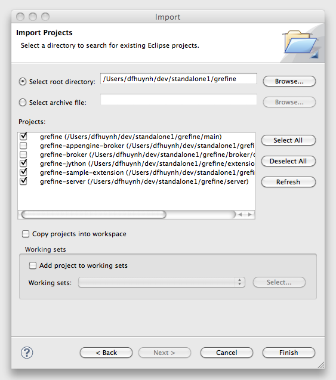

_OpenRefine Developer's Guide_

# Guide for OpenRefine Developers

## Build and Run OpenRefine from an IDE (easier)

OpenRefine' source comes with [http:_www.eclipse.org/_](Eclipse) project files.

### Eclipse

At the command line, go to a directory **not** under your Eclipse workspace directory and check out the source:

```
git clone https://github.com/OpenRefine/OpenRefine.git
```

Then in Eclipse, invoke the Import ... command



Pick Existing Projects into Workspace



Locate the directory where you've checked out Google Refine. Eclipse should detect the sub-projects "grefine", "grefine-server", etc.



Locate the directory where you've checked out OpenRefine. Eclipse should detect the sub-projects "grefine", "grefine-server", etc.

Note that the above steps are already packaged for you if you look for the <tt>Refine.launch</tt> file in the <tt>server/IDEs/eclipse</tt> folder inside the OpenRefine source code. To execute, right click on that file, select "Run As...", then click on "Refine", this should run OpenRefine with the above parameters already set. After the first execution, this command should be updated automatically to your list of Run launches so you can find it there.

## Build and Run OpenRefine from the command line using Apache Ant (Fairly Easy and recommended for Windows users)

[Get Development Version](Step+by+step+to+Get+Development+Version)

## Build and Run OpenRefine from the command line (harder but more comprehensive)

On Mac OS X and Linux the OpenRefine build system requires you to have a Unix shell; just use a shell compatible with <tt>/bin/sh</tt>. On Windows you can use the Windows command line. (go to <tt>Start</tt> then <tt>Run</tt>, type <tt>cmd</tt> and click <tt>OK</tt>). The <tt>refine.bat</tt> on Windows only supports a subset of the functionality, supported by the <tt>refine</tt> shell script.

NOTE: The Ant build is not designed to be run separately. It expects things to be set up by the shell script/batch file.

To see what functions are supported by OpenRefine's build system, type

```
./refine -h
```

to get a list of them.

**NOTE:** When running from the Windows command line, you should omit the <tt>./</tt>

```
refine -h
```

### Building
```
./refine build
```

### Running
```
./refine
```

### Testing

Since OpenRefine is composed of two parts, a server and a in-browser UI, the testing system reflects that:

- on the server side, it's powered by [http:_testng.org/_](TestNG) and the unit tests are written in Java;
- on the client side, it's powered by [http:_www.getwindmill.com/_](Windmill) and the [http:wiki.github.com/windmill/windmill/javascript-tests](functional+tests+are+written+in+Javascript);

To run the complete testing harness, simply type

```
./refine test
```

The above command requires you to have [http:_www.python.org/_](Python) and [http:curl.haxx.se/](Curl) installed on your machine and available in the path (you might already do, even if you don't know about it so just try it once and see what errors you get). Note that you don't need to have Windmill installed, the script will install it for you and build a proper Python [http:_pypi.python.org/pypi/virtualenv_](virtualenv) so that you don't have to worry about version collisions or polluting your existing Python installation.

If you want to run only the server side portion of the tests run

```
./refine server_test
```

or, if you want to run only the client side portion of the tests run

```
./refine ui_test
```

If you get an an error saying "No default or local profile has been set" from Windmill, add the following two lines to your <tt>~/.windmill/prefs.py</tt> file:

```
MOZILLA_BINARY='/usr/bin/firefox'                                                               
MOZILLA_DEFAULT_PROFILE='~/.mozilla/firefox/'
```

#### Testing in Eclipse

You can also run the server-side part of the tests directly from Eclipse. To do that you need to have the TestNG launcher plugin installed. If you don't have it, you can get it by [http:_help.eclipse.org/galileo/index.jsp?topic=/org.eclipse.platform.doc.user/tasks/tasks-124.htm_](installing+new+software) from this update URL

```
http://beust.com/eclipse
```

Once the TestNG launching plugin is installed in your Eclipse, right click on the source folder , select "Run As -> TestNG Test". This should open a new tab with the TestNG launcher running the OpenRefine tests.

#### Testing on Windows

In addition to Python, the [http:_sourceforge.net/projects/pywin32/_](Python+for+Windows+extensions) are required to run Windmill on Windows. Without it Windmill fails to respond and/or gives an <tt>ImportError?: No module named win32api</tt>

Curl is also required, but you can install it when you install Cygwin (there is a module for it).

## Building Distributions (Kits)

The Refine build system uses Apache Ant to automate the creation of the installation packages for the different operating systems. The packages are currently optimized to run on Mac OS X which is the only platform capable of creating the packages for all three OS that we support.

To build the distributions type

```
./refine dist <version>
```

where 'version' is the release version (for example, 2.6b1).

## Troubleshooting

### Windows

On Windows, OpenRefine requires the [http:_java.sun.com/javase/downloads/index.jsp_](Java+JDK) to be installed. Once these are installed you then need to [http:confluence.atlassian.com/display/DOC/Setting+the+JAVA\_HOME+Variable+in+Windows](Set+the+%27JAVA_HOME%27+environment+variable) (please ensure it points to the JDK, and not the JRE) and the ANT\_HOME environment variable (this is set up in a similar way to JAVA\_HOME, but should point to the <tt>Tools/Ant</tt> directory in OpenRefine's source code). You may need to reboot your machine after setting these environment variables.

Open the Windows command line. Navigate to your installation directory, then run OpenRefine (the <tt>./</tt> should be omitted when running any of the Refine commands from the Windows command line)

```
# cd 'C:\\path_to_installation_directory'
   # refine
```

If you receive a message <tt>Could not find the main class: com.google.refine.Refine. Program will exit.</tt> this means that the <tt>JAVA_HOME</tt> variable is likely not set correctly.

### Linux

#### Installing Java

If your Linux distro doesn't have Java installed and you have support for <tt>apt-get</tt> (say, Debian or Ubuntu) you can read [http:_www.cyberciti.biz/faq/howto-ubuntu-linux-install-configure-jdk-jre/_](this+helpful+page). Make sure that JAVA\_HOME points to your JDK (Java developer kit), the one that contains the compiler, and not the JRE (Java runtime environment) which is what you need to actually run a Java program.

