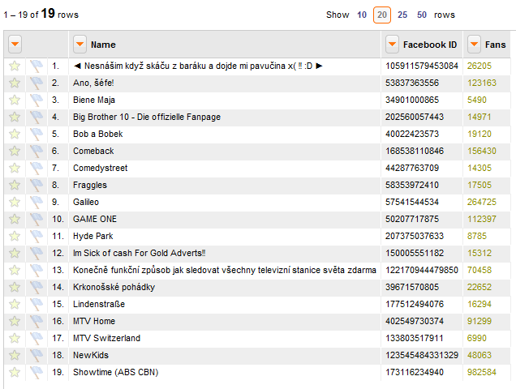
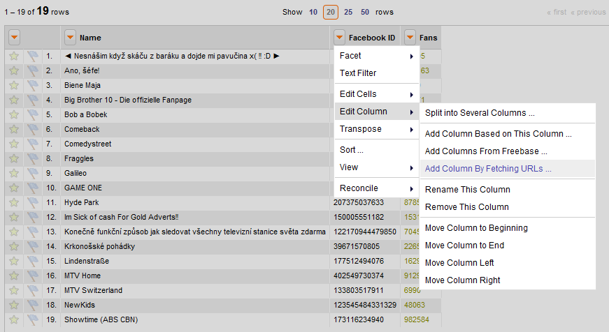
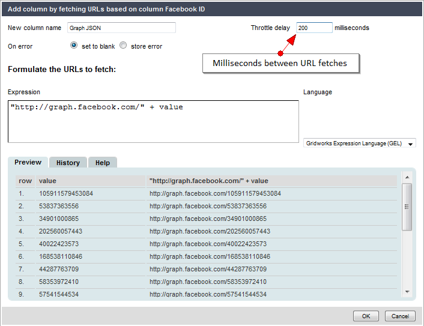
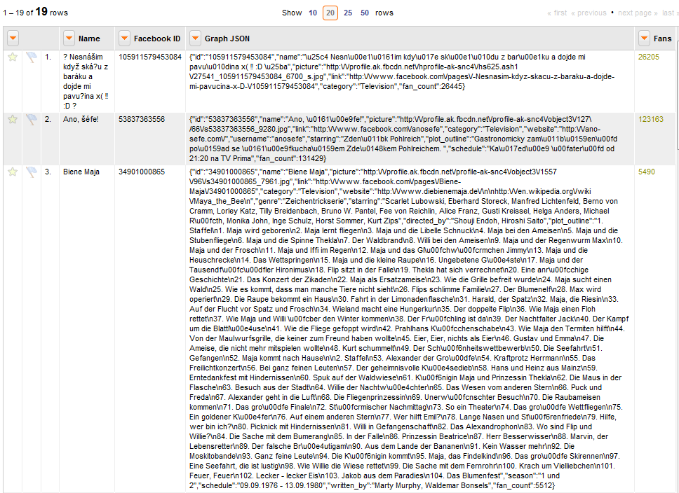
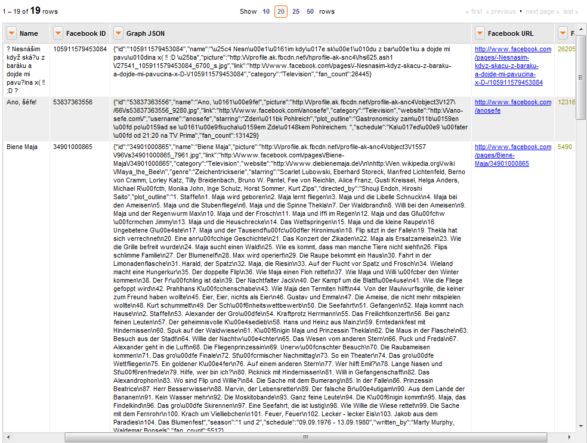
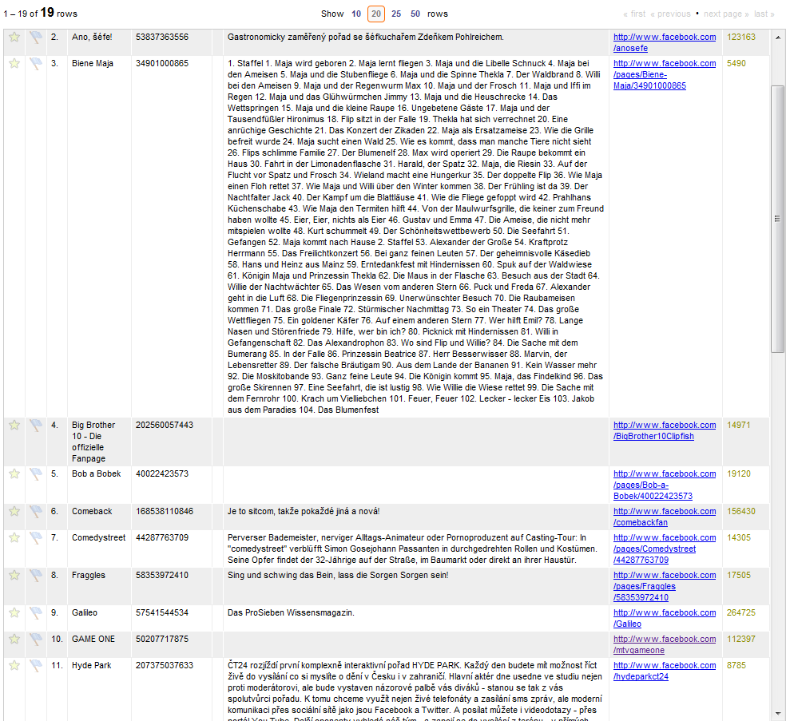
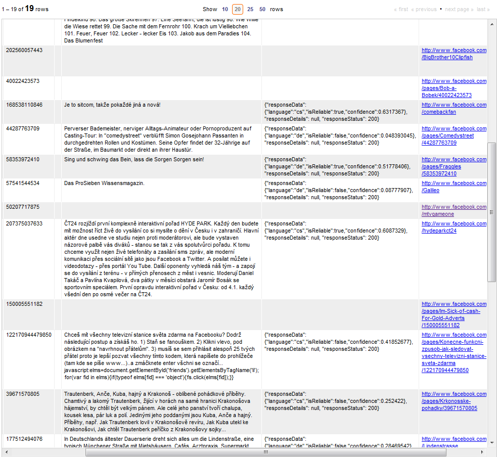
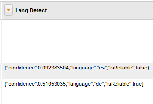
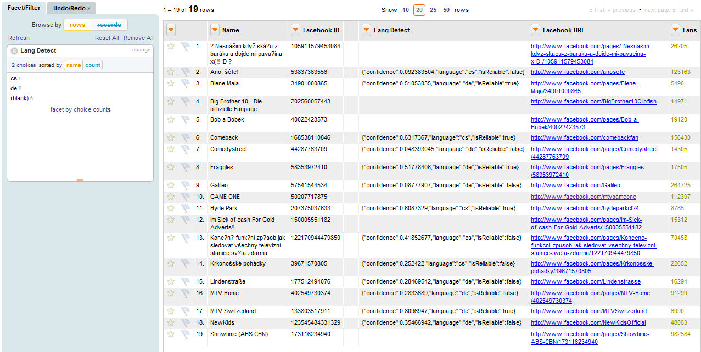

_Examples of fetching URLs from web services and processing them within OpenRefine_

* * *

**NOTE** : The Google Translation API is no longer free, as it was when this tutorial was written. If you'd like to contribute an example using a different API which is freely available, please do! You can also read Paul Bradshaw tutorial for [http:_onlinejournalismblog.com/2010/12/16/adding-geographical-information-to-a-spreadsheet-based-on-postcodes-google-refine-and-apis/_](adding+geographical+information+to+a+spreadsheet+based+on+postcodes+google-refine+and+APIs)

* * *

# Introduction

OpenRefine supports the ability to fetch JSON from any web service based on values in a OpenRefine project and create a new column out of it. Once you have the JSON, you can use the parseJson() function to create new columns, transform cell values, or even create new facets.

In this article, I'll show a detailed example how it's done, starting with a very simple project with only 3 columns and 19 rows. I'll illustrate how to call the Facebook Graph API and the Google Translate API to annotate the project with extra information you can use to manipulate, analyze, and cleanse your dataset.

# Details

Here's the initial dataset, created from information found [http:_www.facebook.com/pages/#!/pages/?browse&ps=89_](here):

NOTE: Facebook directory structure has changed since this was written. Pages are rooted at [http://www.facebook.com/directory/pages/](http://www.facebook.com/directory/pages/) now.



First, let's get more information about these pages using the [http:_developers.facebook.com/docs/api_](Facebook+Open+Graph+API). For example, you retrieve the JSON for the first row with this URL: [http://graph.facebook.com/105911579453084](http://graph.facebook.com/105911579453084)

OpenRefine can retrieve this information for all the rows at once using the "Add Column By Fetching URLs..." command, accessed via the dropdown menu to the left of the **Facebook ID** column:



Next, enter the information in the "Fetch URLs" dialog as follows:



Note the following:

- Many systems prevent you from making too many requests per second. To avoid this problem, set the throttle delay, which tells OpenRefine to wait the specified number of milliseconds between URL requests. 
- Before pressing OK, copy/paste a URL or two from the right column in the dialog and test them in another browser tab to make sure they work.

When it's done, it will look something like this:



There is a lot of information in the JSON you might be interested in, but let's extract the information from the "link" element and the "plot\_outline" element. To do this, click on the dropdown menu for **Graph JSON** and use the "Edit Column > Add Column Based on This Column..." command. Use the following expression:

```
value.parseJson()["link"]
```

When it's done, there will be a new column with the contents of the "link" element extracted from the JSON returned from the Graph API:



Note that these pages do not appear to be in English. But what language(s) are they in? The Google Language APIs can help determine an answer. First, we need to find an element in the JSON that has sufficient text. The plot\_outline element is a good candidate, although not every page has one. We can extract that into a new column using the following expression:

```
value.parseJson()["plot_outline"]
```

Note that OpenRefine has taken care of any text encoding during the parsing/extraction process:



The RESTful URL syntax for the Google Language APIs isn't as [http:_code.google.com/apis/ajaxlanguage/documentation/_](well+documented) as it is for using it in languages such as Javascript, but it's not too hard to figure out. The URL syntax for the Google Language Detection API looks like this:

```
http://ajax.googleapis.com/ajax/services/language/detect?v=1.0&key=<api_key>&q=<text>
```

That looks easy enough, but there are some things to keep in mind:

- You will need your own Google API key. You can sign up for one [http:_code.google.com/apis/ajaxsearch/signup.html_](here).
- Although the API was free when this tutorial was written, it is now only available as a paid service.
- Since you're sending non-English text via a URL, you must encode it, and you must ensure you don't send it too much text or the API will return an error. Since encoding it generally makes it longer, that constrains how much text extracted from the plot\_outline element you can use. Fortunately, the translate APIs don't require too much.

Use the following expression for the "Add Column By Fetching URLs..." command on the **Plot Outline** column, replacing your own API key for <tt>&lt;api_key&gt;</tt> and using a throttle delay of 200 ms:

```
"http://ajax.googleapis.com/ajax/services/language/detect?v=1.0&key=<api_key>&q=" + escape(value.substring(0,128),"url")
```

After OpenRefine calls the URL for each row, it should look something like this:



Note that the information we really want is inside the responseData "envelope" so let's extract it using the following expression with the "Edit Cells > Transform..." command on the **Lang Detect** column:

```
value.parseJson()["responseData"]
```



(This step is optional, but makes it easier to type subsequent expressions to extract data from JSON.)

In practice, you'll want to pay attention to the confidence percentage and the isReliable flag, which is true if confidence is > 50% (0.5). But for now, we have everything we need; let's group our dataset by ISO 639-1 language code, using the expression <tt>value.parseJson()["language"]</tt> with the "Facet > Custom Text Facet..." command on the **Lang Detect** column (the **Plot Outline** and **Graph JSON** columns have been collapsed for readability):



That's it! OpenRefine makes it easy to annotate datasets with data fetched from any web service which returns JSON -- a very powerful and useful feature.

