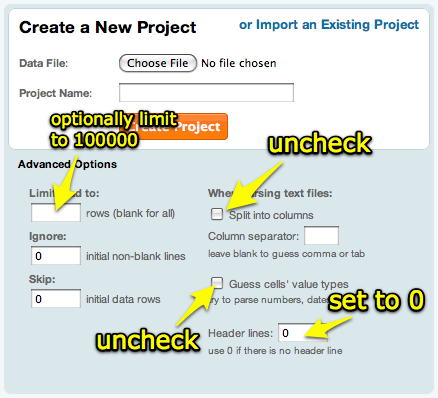
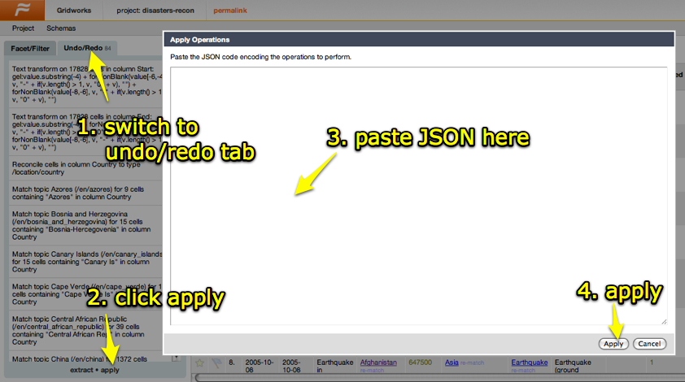

Import the log file:

- without splitting into columns
- with # header lines set 0



Then apply the following operations: (You may need to rename Column 1 to "Column" before applying)

```
[
    {
      "op": "core/column-split",
      "description": "Split column Column by separator",
      "engineConfig": {
        "facets": [],
        "includeDependent": false
      },
      "columnName": "Column",
      "guessCellType": true,
      "removeOriginalColumn": true,
      "mode": "separator",
      "separator": "-",
      "regex": false,
      "maxColumns": 3
    },
    {
      "op": "core/column-addition",
      "description": "Create column Time at index 3 based on column Column 3 using expression grel:value[2,value.indexOf(\"]\")].toDate(\"dd/MMM/yyyy:hh:mm:ss\")",
      "engineConfig": {
        "facets": [],
        "includeDependent": false
      },
      "newColumnName": "Time",
      "columnInsertIndex": 3,
      "baseColumnName": "Column 3",
      "expression": "grel:value[2,value.indexOf(\"]\")].toDate(\"dd/MMM/yyyy:hh:mm:ss\")",
      "onError": "set-to-blank"
    },
    {
      "op": "core/column-addition",
      "description": "Create column Method at index 3 based on column Column 3 using expression grel:value.substring(value.indexOf('\"') + 1).partition('\"')[0].split(\" \")[0]",
      "engineConfig": {
        "facets": [],
        "includeDependent": false
      },
      "newColumnName": "Method",
      "columnInsertIndex": 3,
      "baseColumnName": "Column 3",
      "expression": "grel:value.substring(value.indexOf('\"') + 1).partition('\"')[0].split(\" \")[0]",
      "onError": "set-to-blank"
    },
    {
      "op": "core/column-addition",
      "description": "Create column Path at index 3 based on column Column 3 using expression grel:value.substring(value.indexOf('\"') + 1).partition('\"')[0].split(\" \")[1]",
      "engineConfig": {
        "facets": [],
        "includeDependent": false
      },
      "newColumnName": "Path",
      "columnInsertIndex": 3,
      "baseColumnName": "Column 3",
      "expression": "grel:value.substring(value.indexOf('\"') + 1).partition('\"')[0].split(\" \")[1]",
      "onError": "set-to-blank"
    },
    {
      "op": "core/column-addition",
      "description": "Create column Agent at index 3 based on column Column 3 using expression grel:value.rpartition('\"')[0].rpartition('\"')[2]",
      "engineConfig": {
        "facets": [],
        "includeDependent": false
      },
      "newColumnName": "Agent",
      "columnInsertIndex": 3,
      "baseColumnName": "Column 3",
      "expression": "grel:value.rpartition('\"')[0].rpartition('\"')[2]",
      "onError": "set-to-blank"
    },
    {
      "op": "core/column-addition",
      "description": "Create column ResponseCode at index 3 based on column Column 3 using expression grel:with(value.partition('\" ')[2], s, s.partition(\" \")[0])",
      "engineConfig": {
        "facets": [],
        "includeDependent": false
      },
      "newColumnName": "ResponseCode",
      "columnInsertIndex": 3,
      "baseColumnName": "Column 3",
      "expression": "grel:with(value.partition('\" ')[2], s, s.partition(\" \")[0])",
      "onError": "set-to-blank"
    },
    {
      "op": "core/column-addition",
      "description": "Create column ContentLength at index 3 based on column Column 3 using expression grel:with(value.partition('\" ')[2].partition(\" \")[2], s, s.partition(\" \")[0])",
      "engineConfig": {
        "facets": [],
        "includeDependent": false
      },
      "newColumnName": "ContentLength",
      "columnInsertIndex": 3,
      "baseColumnName": "Column 3",
      "expression": "grel:with(value.partition('\" ')[2].partition(\" \")[2], s, s.partition(\" \")[0])",
      "onError": "set-to-blank"
    },
    {
      "op": "core/column-addition",
      "description": "Create column Referer at index 3 based on column Column 3 using expression grel:with(value.partition('\" ')[2].partition(\" \")[2], s, s.partition(' \"')[2].partition('\" ')[0])",
      "engineConfig": {
        "facets": [],
        "includeDependent": false
      },
      "newColumnName": "Referer",
      "columnInsertIndex": 3,
      "baseColumnName": "Column 3",
      "expression": "grel:with(value.partition('\" ')[2].partition(\" \")[2], s, s.partition(' \"')[2].partition('\" ')[0])",
      "onError": "set-to-blank"
    },
    {
      "op": "core/column-removal",
      "description": "Remove column Column 3",
      "columnName": "Column 3"
    }
  ]
```

Here is how to apply the operations:



## Facets

To create a referrer domain facet, use this expression on the Referer column:

```
if(value == "-", value, value.partition("://")[2].partition("/")[0])
```
