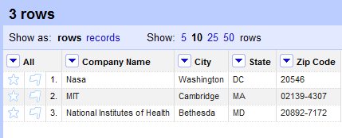
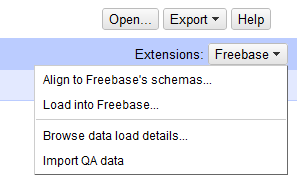
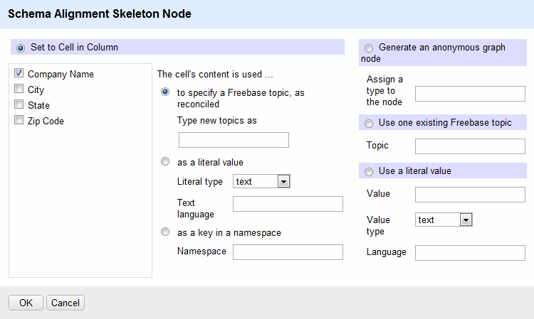
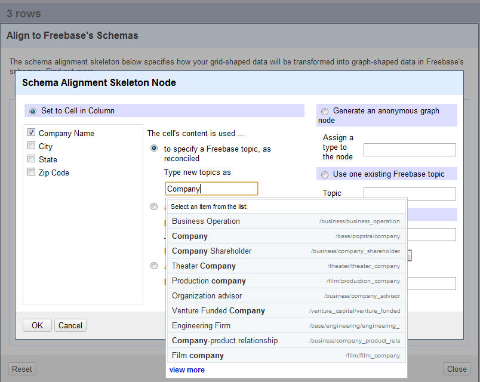

## Overview

In OpenRefine, the **Schema Alignment Skeleton** (a template for loading triples) specifies how your grid-shaped data of rows and columns will be transformed into graph-shaped triples in Freebase's schemas. For more info on triples and the Freebase Triple Loader, see [http:_wiki.freebase.com/wiki/T1:Intro\_to\_Triple\_Loader_](Intro+to+Triple+Loader)

(The **Schema Alignment Skeleton** still has some rough edges, and is not entirely intuitive, but we'll revisit it when its clear what Google's plans are for data loading into Freebase.)

## Align Columns to Freebase Types where necessary

Usually you want to begin aligning your data columns to Freebase Types where it makes sense. For instance, in the case of data on Companies, you probably want to Align the column <tt>Company Name</tt> with the idea or notion of some sort of <tt>Company Type</tt> that exists in Freebase.

Here is an example data set with simple company data:

To begin alignment with Freebase Schema and Freebase Types choose the menu item **Extensions: Freebase** --> **Align to Freebase's schemas... as shown:**

then the **Schema Alignment skeleton** initial dialog window should appear...

Notice in that screenshot that the 1st column from my data set <tt>Company Name</tt> is also shown in the skeleton as the 1st left column. And the City, State, & Zip Code are being represented possibly as Properties of <tt>Company Name</tt>, but more about Properties later on this page.

For now, it is important to note that sometimes you may not necessarily want to load and align your data with the 1st column in your data AS the key reference column. If your 1st column isn't a very good candidate for a Freebase Type like **IS A**"Business Operation" or **IS A**"Person", but instead would align better with a Freebase Property, such as **HAS A**"Net Profit" or **HAS A**"Gender" then you can click on the key reference cell and change that (in example screenshot, clicking on "Company Name").

This will then open the **Skeleton Node** dialog allowing you to change with a checkmark which column will be your key reference column (ie, a Freebase Type) to align with your other remaining columns (ie, possible Freebase Properties)

In the screenshot below, the **Skeleton Node** dialog allows for specifying what your cell column values actually represent. In the case of a Company Name, you would choose <tt>to specify a Freebase topic , as reconciled</tt> and enter the Freebase Type that the checkmarked column would align with:

Freebase contains many Types and those types have specific Properties in some cases. Typing in and selecting the appropriate Freebase Type to match with your key Columns is one of the challenges that the **Schema Alignment Skeleton Node** tries to assist with.

In the following screenshot, I've typed <tt>Company</tt> into the box and being shown a list of Freebase Types which would probably best align with my entered keyword <tt>Company</tt>. You can backspace and type in other keywords that might be a closer match to describe your column. In this case, it looks like the Freebase Type <tt>Business Operation</tt>, is the closest match, the first in the list, to the term <tt>Company</tt>. Currently, the **Skeleton Node** dialog here uses some backend type hinting technology, aliases, and a [http:_wiki.freebase.com/wiki/Freebase\_Suggest_](Freebase+Suggest+component) to help suggest to you some Freebase Types that might match with the keywords you entered.

This is probably the hardest part of the whole process: Figuring out which Freebase Type to use. And if you need more help discovering which Freebase Types to use, you can certainly email your column headings to the Refine mailing list and ask for community help and suggestions on the most appropriate Freebase Types your data aligns with. In fact, we welcome that community idea exchange!

## Align Column cell values to Freebase Properties where necessary

(more coming soon)

## Previewing your Schema Skeleton template

(more coming soon)

